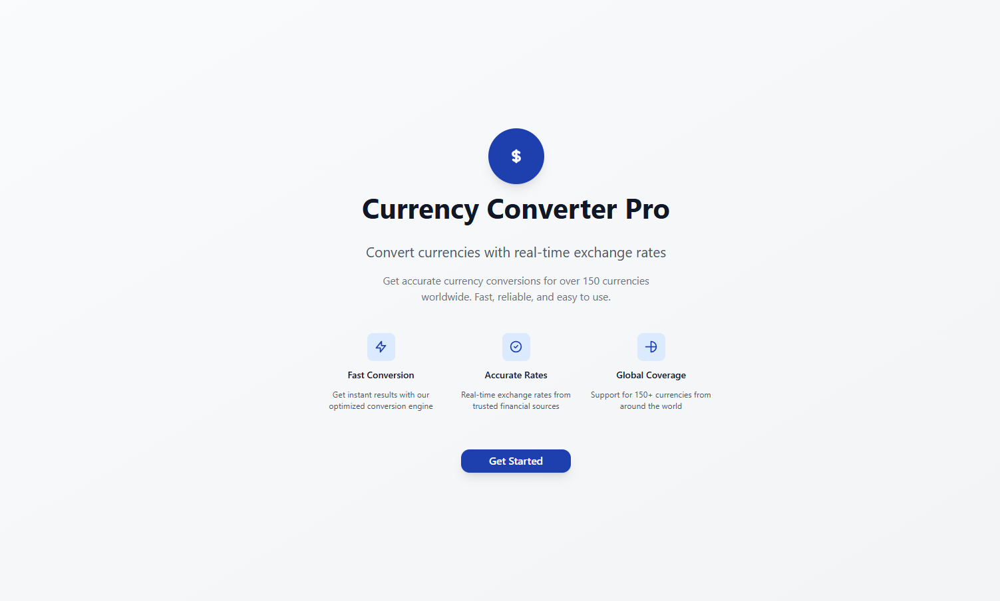
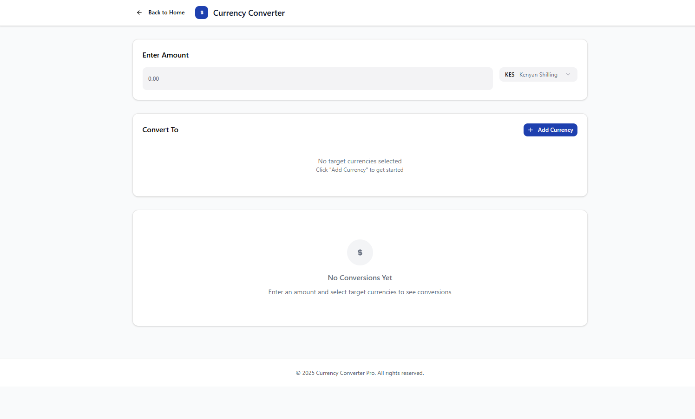

# Currency Converter Web App

This is a simple and modern currency converter built with **React**, **React Router**, **Tailwind CSS**, and **Lucide Icons**.
It fetches real-time exchange rates from the [ExchangeRate-API](https://www.exchangerate-api.com/).

---

## Features

- Real-time currency conversion using ExchangeRate-API
- Clean and responsive UI with TailwindCSS
- Reusable UI components (`Card`, `Input`, `Select`)
- Convert between **any two currencies** instantly
- Mobile-first, fully responsive
- Two-page structure:
  - **Landing Page** (introduction, call-to-action)
  - **Converter Page** (main app)

---

## Project Structure

```bash
src/
 ├─ components/
 │   └─ ui/
 │       ├─ Card.jsx
 │       ├─ Input.jsx
 │       └─ Select.jsx
 ├─ context/
 │   └─ CurrencyContext.jsx
 ├─ features/
 │   └─ converter/
 │       ├─ AmountInput.jsx
 │       ├─ ConvertFrom.jsx
 │       ├─ ConvertTo.jsx
 │       └─ ResultBox.jsx
 ├─ pages/
 │   ├─ Landing.jsx
 │   └─ Converter.jsx
 ├─ routes/
 │   └─ AppRoutes.jsx
 ├─ lib/
 │   └─ api.js
 ├─ App.jsx
 └─ main.jsx

## Installation & Setup

1. Clone the repo
git clone https://github.com/yourusername/currency-converter.git
cd currency-converter

2. Install dependencies
npm install

3. Set up environment variables
Create a .env file in the project root:

VITE_EXCHANGE_RATE_API_KEY=your_api_key_here

4. Start development server
npm run dev

-- API Setup
This project uses ExchangeRate-API

Sign up and get your free API key

Add it to .env as shown above

The app will automatically fetch live exchange rates

Screenshots
Landing Page



Converter Page

